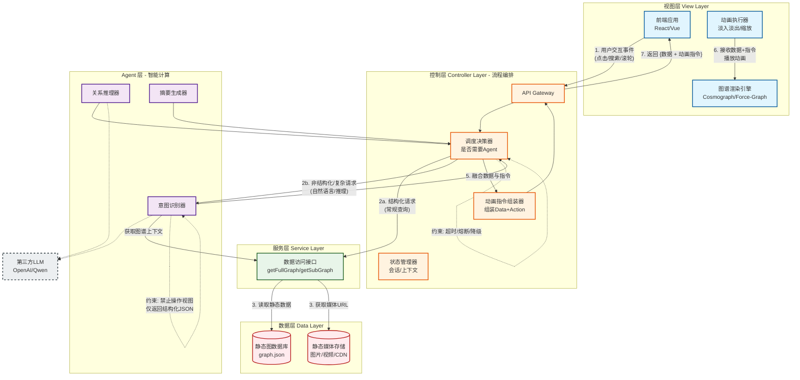

投资学课程：《并购与重组》、《投资学》、《公司金融》、《国际投资》

知识图谱生成：Docling-Graph，以json格式保存

知识图谱构建：放大/缩小动画，结点内可以有：“文字解释”、“图片”、”动画“

# 架构设计

控制层分析用户输入指令，分析下一步状态，调用组件完成

视图层，显示，接受用户输入

agent层，智能助手的层次

数据层，放置图谱和资源文件，目前只做查的功能。

项目根目录/
├── backend/                     # 后端代码（Python）
│   ├── controller/              # 控制层 - 流程编排
│   │   ├── __init__.py
│   │   └── graph_controller.py  # 图谱相关API逻辑
│   ├── service/                 # 接口/服务层 - 数据访问
│   │   ├── __init__.py
│   │   └── data_service.py      # 读取graph.json，获取媒体URL
│   ├── agent/                   # Agent层 - 智能计算
│   │   ├── __init__.py
│   │   ├── intent_agent.py      # 自然语言意图识别
│   │   └── reason_agent.py      # 关系推理
│   ├── models/                  # 数据模型（Pydantic/Schema）
│   │   ├── __init__.py
│   │   ├── graph_model.py       # 节点/边/图谱结构
│   │   └── response_model.py    # 统一返回格式（数据+动画指令）
│   ├── core/                    # 核心配置与工具
│   │   ├── __init__.py
│   │   ├── config.py            # 配置项（LLM密钥、路径）
│   │   └── exceptions.py        # 自定义异常（超时、降级）
│   ├── utils/                   # 通用工具函数
│   │   ├── __init__.py
│   │   └── file_reader.py       # JSON读取辅助
│   ├── main.py                  # 应用入口（FastAPI/Flask）
│   └── requirements.txt         # Python依赖
├── frontend/                    # 前端代码（静态资源+JS）
│   ├── index.html               # 主页面
│   ├── css/                     # 样式文件
│   ├── js/                      # 前端逻辑（视图层）
│   │   ├── app.js               # 主应用
│   │   └── graph-renderer.js    # 图谱渲染与动画执行
│   └── static/                  # 前端静态资源
│       └── (指向外层resource)
├── data/                        # 知识图谱数据（静态）
│   └── graph.json               # 核心图谱JSON（含节点、边、media链接）
├── resorce/                     # 动画资源/媒体文件（图片、视频）
│   ├── images/
│   │   └── concept_*.png
│   └── videos/
│       └── concept_*.mp4